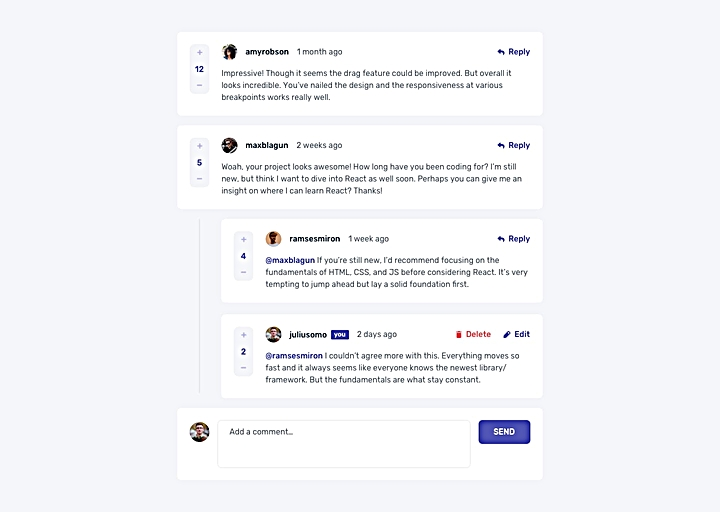
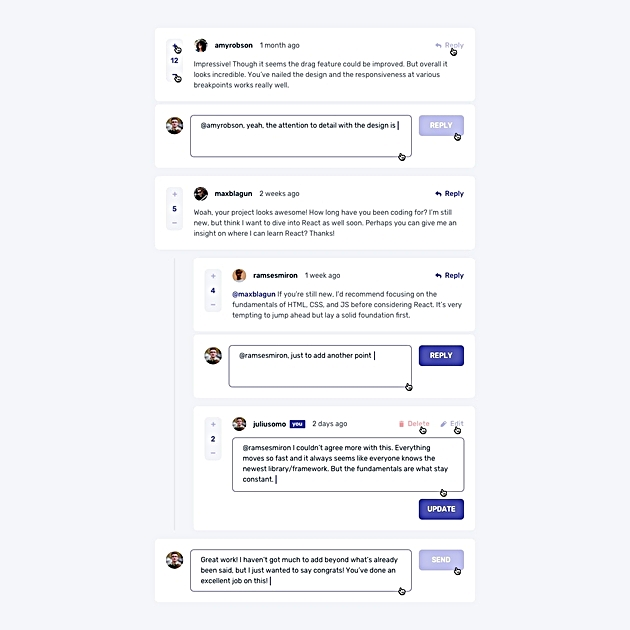
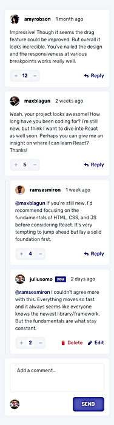
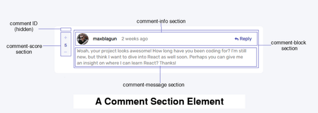
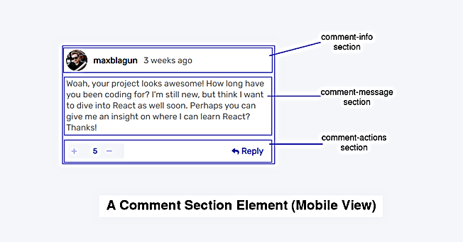
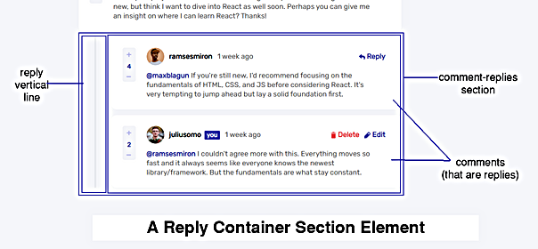
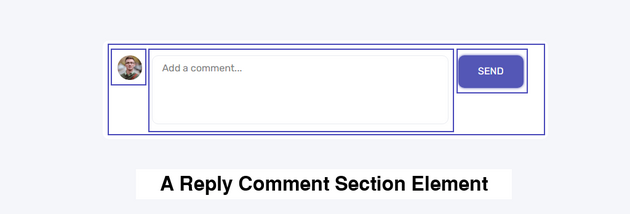

  
   
  
  
  
  
  

# Interactive Comment Section

My project is an interactive comment section that allows users to:
- Create new comments
- Edit existing comments
- Delete comments
- Upvote/downvote comments
- Reply to comments
- View all comments
- View comments by specific users
- Desktop/Mobile responsive design

It features a dynamic creation of the comments from a json data stored in the browsers local storage. This data consists of all the comments and their replies

It features desktop/mobile responsivity for an optimal user experience. 
  

## Project Screenshots

## Project Challenge

Users should be able to:

- View the optimal layout for the app depending on their device's screen size
- See hover states for all interactive elements on the page
- Create, Read, Update, and Delete comments and replies
- Upvote and downvote comments
- **Bonus**: Building a purely front-end project, use `localStorage` to save the current state in the browser that persists when the browser is refreshed.
- **Bonus**: Use timestamps and dynamically track the time since the comment or reply was posted.
- **Bonus**: Implement a single voting feature; such that once a user has voted for a comment, further voting is not allowed.
  

## Project Expected behaviour

- First-level comments should be ordered by their score, whereas nested replies are ordered by time added.
- Replying to a comment adds the new reply to the bottom of the nested replies within that comment.
- A confirmation modal should pop up before a comment or reply is deleted.
- Adding a new comment or reply uses the `currentUser` object from within the `data.json` file.
- You can only edit or delete your own comments and replies.
  

## Project Design

This project is fundamentally made of three elements:
- a comment section element
    - comment-ID section
    - comment-info section
    - comment-message section
- a reply comment section element
    - reply vertical line
    - comment-replies section
- a reply container section element

  

## Project WorkFlow

#### 1. Initial Structure and Styles
this is done with pure html and css.  the aim is to know what html elements & classes i need,  to create each element that would make up the page before any dynamic creation.

 

#### 2. Event Handlers for all interactive buttons
- the comment reply button
- the comment send-reply button
- the edit button
- the delete button
- the upvote & downvote button (single voting feature)

 

#### 3. Dynamic Tracking of the comment/reply post time
this feature makes it possible so that for each comment,  you would have a clue of the exact time it was posted   seconds ago, hours ago, months ago e.t.c

 

#### 4. Dynamic Rendering of the comments
having the structure, styles and event handlers all set   it was time to use javascript to render the webpage.  For now, i loaded the json in the working directory which contains comments data,  into a variable called DATA as a javascript Object.
   Using functional programming, i could generate HTMLElements  for each comment in the data and added it to the DOM, rendering the comments.

 

#### 5. Mobile Responsiveness Implementation
As seen in the screenshots, the "COMMENT SECTION ElEMENT" 
and the "REPLY COMMENT SECTION ELEMENT"  for both desktop view and mobile view  has slightly different structure to the mobile view.

Using a media querry of (max-width: 700px) 
i was able use javascript to querry the page for its widths  
then if it satifies the media querry, it renders the page in mobile form.

 

#### 6. Local Storage of Comment Data
Building a purely front-end project,  
the plan was to store the comments data  
in the local storage of user's browsers. 
it is from this storage the comments are  
Created, Read, Updated and Deleted.
  

##  Project Spotlight: Noteworthy Features and Their Development

#### 1. Comment Identification 
every comment has an identification number. 
and in order to delete & edit a particular comment 
we need to be able to know the ID of the comment section 
the delete or edit button referes to. 

therefore the comment ID is included 
in the commenst section element 
but is made to be hidded via its display property. 

Also, the fact that the ID of each comment is on the page 
simplied the implementation of the single voting feature. 
More on this later.

`show snippets of getCommentSectionID & searchForCommentViaID`

 

#### 2. Comment Delete Feature
based on the page expected behaviour,  
a confirmation modal should pop up  
before a comment or reply is deleted.  

this was implemented using a bootstrap modal widget, 
with further tweaking added; such that,
- when the delete button is clicked, 
- a tag via a class-name is placed  
  on the delete button element of the comment section element;  
  the `show-modal` class,
- button click will cause the bootstrap modal widget to pop up,
- modal showcases two options
    - No, Cancel
    - Yes, Delete
- No, Cancel meaning "i no longer want to delete this comment".   
  this will search for the HTMLElement having the class `show-modal` 
  then remove the name `show-modal` from its list of class names.
- Yes, Delete will also search for the HTMLElement   
  having the class `show-modal` which is a button element
- then, it gets the comment section  
  wherein the button elements lies  
  and removes the comment section from the DOM
- lastly, we would use the comment section ID  
  to search for its comment information in the comment data  
  that is located in the local storage of the browser. 

`show snippets of handleDeleteButton(), handleModalDeleteButton(), handleModalDontDeleteButton()`

#### 3. Comment Single Voting Feature
Each user can either downvote or upvote a comment. 
We want to make is so that user can vote only once. 

This was implemented by storing an Array of IDs in the local storage of the browser.
This IDs corresponds to the IDs of the comments
user has already voted for.

Once the ID of the comment section is in this Array, 
the voting icon of that comment section 
will be made to be unclickable. 
this is implemented by adding/removing  
a class name `clickable` from the voting icon element.

Once the ID of the comment section is in this Array, 
no matter the clicks on the voting icon  
the comment score value will not increase

`show snippet of the isVotedFor()`

 

#### 4. Comment Time of Post Tracking Feature
we intend to dynamically track the time  
since the comment or reply was posted.

in the comment information in the comment DATA, 
there is a property called `createdAt` that keeps track of the date and time the comment was created.

we compare the value with the present date and time 
so we can know how long the comment/reply was posted. 

`show snippet of the getDateDiff()`

 

#### 5. Comment Ordering
There two types of comments. 
first-level comment and second-level comment. 
second-level comments are comments which are replies to another comments.

first-level comments are items in the `comments` property.
second-level comments are items in the `replies` property.

When rendering,  
first-level comments are to be ordered by their comment score. 
second-level comments are to be ordered by the time-of-post.

Therefore before rendering the list of first-level comments is sorted, then rendered.

The second-level comment will be sorted by time-of-post by default; since it is by time-of-post they are appended to the `replies` property Array.
  

##  Project Script: functions division
Scripting is divided into Nine(9) Aspect:
- Loading Data into Browser Local Storage
- Initial Rendering of the Webpage
- Setting up of Mobile Responsiveness
- Utility Functions
- Functions for generating sections of webpage
- Functions for Handling Button Interactions
- Functions for Manipulating the Database
- Setting up the Event Handlers
